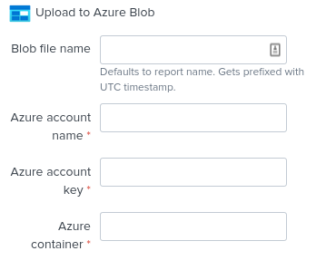

# Upload to Azure Blob add-on to Splunk

This is an add-on powered by the Splunk Add-on Builder.

It is a custom alert action which let's you upload the results of a scheduled Splunk report to a Azure Storage Blob of your choosing.

This can be useful if you have some data in Splunk which you would like export and vizualize other places, e.g. PowerBI.

Tested and verified with Python3 and Splunk 8.2.0.

## Installation and setup

Pretty straightforward

1. Install only on SH or SHC (via SHD) and restart

2. If needed configure proxy settings

## Configuring the alert action

Navigate to your report and enable its scheduling.

| Element | What |
-----|------
| Blob file name | If you want to overwrite the report name |
| Azure account name | Your Azure storage account |
| Azure account key | See [Azure docs](https://docs.microsoft.com/en-us/azure/storage/common/storage-account-keys-manage?tabs=azure-portal#view-account-access-keys) on how to obtain |
| Azure container | Where you would like to store the blob |



## Limitations and considerations

The user owning the report needs to have a role with the `list_storage_passwords` capability (not in `user` role by default).
Adding this will however have other security implications. A better solution is to have a dedicated service user which owns the reports.

The `Azure account key` is saved in cleartext in savedsearches.conf.
For security reasons the Azure storage account in use should not hold any PII or other sensitive information.

## Troubleshooting

Search `index=_internal source=*splunkd.log upload_to_azure_blob` to view results of script.

Search below gives insights about each run report - depends that index `cim_modactions` exists.

```splunk
index=cim_modactions sourcetype="modular_alerts:upload_to_azure_blob" 
|  transaction pid mvlist=signature
|  table _time, user, search_name, action_status, action_name, signature
```

## Support

This add-on is provided without support, but is supported on a best-effort basis by the community.
Contributions and pull requests are more than welcome.

Official Git repository: <https://github.com/thilles/TA-azure-blob-upload>
